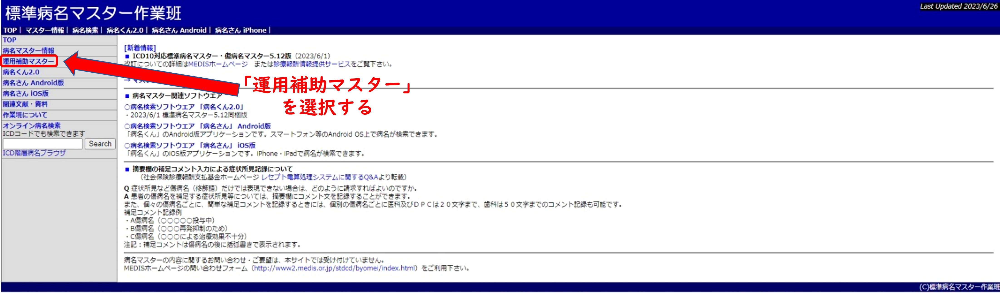
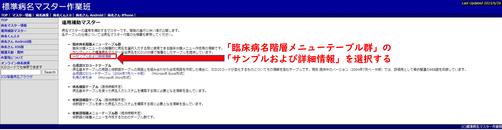
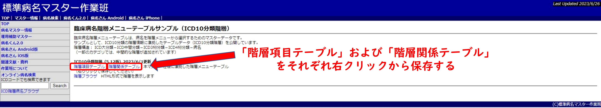

## はじめに

## ファイルダウンロード

### 1. WEB サイトトップ画面の表示 

以下のリンクより、標準病名マスター作業班トップページを表示する。

http://www.byomei.org/index.html

### 2. ダウンロードページの表示

トップページより運用補助マスターに関するページへ移動する。

臨床病名階層メニューテーブル群の詳細情報に関するページへ移動する。

### 3. ダウンロード実行

以下の操作を行い、`階層項目テーブル`および`階層関係テーブル`を取得する。

## フォーマット

`階層項目テーブル`および`階層関係テーブル`のファイルフォーマットは以下の通りである。

| 項目           | 仕様
|----------------|-----------------------
| 文字コード     | Shift-JIS
| 開票コード     | <CR><LF>
| 区切り文字     | カンマ (,)
| ヘッダー       | あり (1 行)
| ダブルクオート | あり

## テーブル構造

### 階層項目テーブル

| 列番号 | 値の概念
|--------|------------------------------------
| 1      | 分類 ID (最上層の分類コード, ICD-10 コード, ICD-10 コード群, はたは 疾患管理番号)
| 2      | 分類表記

### 階層関係テーブル

| 列番号 | 値の概念
|--------|------------------------------------
| 1      | 分類 ID (最上層の分類コード, ICD-10 コード, ICD-10 コード群, はたは 疾患管理番号)
| 2      | 一つ上の階層の コード, 最上層の場合は 1 が入る
| 3      | 最下層フラグ, 最下層の場合は 1 が, それ以外の場合は 0 が入る
| 4      | 予備? (全行に 0 が入っている) 
| 5      | 最上層の分類コード (1 - 22), 最上層以外の場合は NULL
